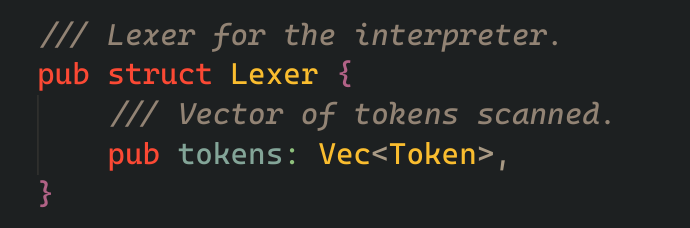
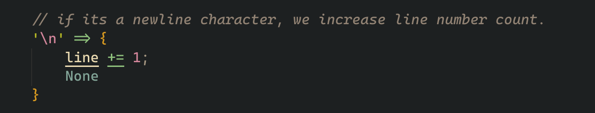

# Making a brainfuck compiler in Rust

### Description

brainf\*ck wikipedia: [brainfuck wikipedia](https://en.wikipedia.org/wiki/Brainfuck)

brainf\*ck basics: [brainfuck basics](https://gist.github.com/roachhd/dce54bec8ba55fb17d3a)

Github: [Github](https://github.com/prashantrahul141/bf-interpreter-rs)

# So What is brainfuck?

lets look up on wikipedia


so basically its an programming language which works with only 8 simple commands, and here are the 8 simple commands:


you might be wondering how you can make something with only these 8 commands to work with

# How does the language work?

imagine a really long line of cells with values stored in the cells, initially all of the values will be zero, we will call this "memory"

```
[0][0][0][0][0][0][0][0][0][0][0][0][0][0][0][0][0][0][0][0][0][0][0][0]

```

now imagine a pointer, pointing to one of the cell in the memory, initially it will point at the first cell.

```
[0][0][0][0][0][0][0][0][0][0][0][0][0][0][0][0][0][0][0][0][0][0][0][0]
                                  ^
```

```
[0][0][0][0][0][0][0][0][0][0][0][0][0][0][0][0][0][0][0][0][0][0][0][0]
 ^
```

all the operations you do using the 8 commands will be done on the memory and using this simple pointer.
you can move the pointer to one cell to right using the right angle bracket operator '>'

```
[0][0][0][0][0][0][0][0][0][0][0][0][0][0][0][0][0][0][0][0][0][0][0][0]
    ^
```

you can move the pointer to one cell to left using the left angle bracket operator '<'

```
[0][0][0][0][0][0][0][0][0][0][0][0][0][0][0][0][0][0][0][0][0][0][0][0]
 ^
```

you can increment the value in the cell, which is currently being pointed at using the plus operator '+'

```
[1][0][0][0][0][0][0][0][0][0][0][0][0][0][0][0][0][0][0][0][0][0][0][0]
 ^
```

you can decrement the value in the cell, which is currently being pointed at using the minus operator '-'

```
[0][0][0][0][0][0][0][0][0][0][0][0][0][0][0][0][0][0][0][0][0][0][0][0]
 ^
```

you can print the value of the cell currently being pointed at in ascii text using the dot operator '.', so if the value is, lets say 83,

```
[83][0][0][0][0][0][0][0][0][0][0][0][0][0][0][0][0][0][0][0][0][0][0][0]
 ^
```

if we look up the value of ascii code 83,


its capital 'S', so the dot '.' operator will print a capital "S".

you can read data from user using the comma "," operator, it will save the data in the cell which is currently pointed at.

and finnaly the opening and closing bracket operators \"[\" \"]\".

the opening bracket operator says, if the data at currently pointed cell is zero, then instead of continuing the execution normally, jump directly to the instruction which comes after the closing bracket operator "]"
its like a loop and if statement combined.

and thats basically it, that's all you need to make a turing complete programming language. I present to you "Hello World!" program in brainfuck.

```bf
>+++++++++[<++++++++>-]<.>+++++++[<++++>-]<+.+++++++..+++.[-]
>++++++++[<++++>-] <.>+++++++++++[<++++++++>-]<-.--------.+++
.------.--------.[-]>++++++++[<++++>- ]<+.[-]++++++++++.
```

now, i would really like to talk more about the language and how people have come up with really smart ways to do different kindof things in the language, but thats beside the video in hand, but you can learn more about it here:

[brainfuck basics](https://gist.github.com/roachhd/dce54bec8ba55fb17d3a)

today, we're going to write an interpreter for brainfuck, and we're going to do that in Rust.

first we create a new binary project using cargo,


# 1. Lexical Analysis

First we need a way to convert a long string of brainfuck operators, into series of lexical tokens.
so we create a "Lexer" structure



it will hold a vector of all the tokens it scanned.
and here's what a single token is:


it holds where the token is present in the input string, and also what type of token it is.


and here is a enum storing all the types of token a token can be, we also add a special EOF, or END OF FILE token which will come in handy later when we come to parsing.


now for scanning, we create a new method on the lexer struct, "scan_tokens"
it will take a string input and return a vector of tokens it scanned.


we will also need to store the line number we're at in the input string, we so create a local variable "line".


and for scanning tokens, we take the input string


then take indiviual characters from the string


and map through each character, we match each character for all the operators


for example, if we find a right angle bracket, we create a token at current line number of type RightAngleBracket.


and simillary we match for <, +, -, ], [ , ",", "." and keep adding tokens at the current line number of that type,



but if we see a newline character, we increment the line count and return None.


and everything else is also ignored, as we consider them as "comments"


then we collect this flat_map into a vector of tokens


we also manually add a EOF token at the end


finally we reverse the tokens vector, and return it

and thats the entire scanning process in one go.


we also add these two helpers, pop and peek which we will need later

and now if we give our lexer a simple brainfuck program like this one

```
>++.
-.
```

it gives us meaningful tokens from the string

```rs
Token { line: 1, token_type: RightAngle }
Token { line: 1, token_type: Plus }
Token { line: 1, token_type: Plus }
Token { line: 1, token_type: Dot }
Token { line: 2, token_type: Minus }
Token { line: 2, token_type: Dot }
Token { line: 2, token_type: Eof }

```

and with that we're done with the lexer.

# 2. Parsing

Now comes "Parsing", in this process we can either create a AST or instructions from the tokens we got from the lexer. we're going to do the later.

we start by creating a new file, and a Parser structure


it consists of two fields, a mutable reference to the lexer, and a vector of statements.


and a statement can be either a NodeStmt or a WhileStmt, A NodeStmt will have a operation code and a WhileStmt will have a vector of statements inside it.


the operations code we will allow are

- MovePtrForward - it moves the pointer one cell forward.
- MovePtrBackward - it moves the pointer one cell backward.
- ReadFromStdin - reads data from stdin and save it in the current cell.
- WriteToStdout - writes current cell data to the stdout.
- Crement - it stores a signed 8 bit value and increments or decrements the value of current cell with that value. I know i could have made two separate instructions for increment and decrement, but a abstracted instruction which can do both just feels right to me for some reason.


we create a public parse function which loops through the tokens and parses statements untill it finds a EOF token.


this also uses this small helper function which just matches the current token we're parsing.


which internally uses this helper function, which just checks if there are not more tokens to parse.


now in the parse_stmt function, we take indiviual tokens, then we match it against the types of tokens possible and return the respective statements,

for simple operations like move pointer one cell to the right, just simple return a NodeStmt with the corresponding operation code.


and for parsing left square bracket, we first create a empty vector of statements, we then recursively call the parse statement function and keep adding the parsed statements to the vector we created untill we reach a closing right square bracket

and since we stop the loop once we reach a closing square bracket we also need to consume that token, finnally we return the vector of parsed statement inside a WhileStmt.

and that parses opening and closing square brackets.

also for the left token types,
if we find a closing square bracket without a opening square bracket, it's parses error.
and EOF token shouldn't be reachable since we don't enter the parse_stmt function if we encounter one.

now if we give our input to lexer and then to parser,

```
+-<>,.
```

we get something like this

```rs
NodeStmt(Crement(1))
NodeStmt(Crement(-1))
NodeStmt(MovePtrBackward)
NodeStmt(MovePtrForward)
NodeStmt(ReadFromStdin)
NodeStmt(WriteToStdout)
```

and with that, our parser is complete.

# 3. VM

we are now at the final stage of our interpreter, a Virtual Machine,
Our Virtual Machine or VM for short, has 1 job, run through the instructions, and execute them.

for the final time, we start by creating a structure, VM, it will hold a reference to
statements it needs to execute, data pointer, and u8 array of size thirty thousands.


we implement a public "run" method, which iterates through each statement and call run_statement method on them.


and here's the run_stmt method, it matches the type of statement and calls run_opcode if its a simple NodeStmt

the run_opcode method literally just matches the operation code which
gets passed to it and directly executes, for example if the operation
code is MovePtrForward, it just increments the data pointer, and for ReadFromStdin operation code, it reads from the standard input and stores them in the current cell.


if the statement we are parsing is a whileStmt, we call while_stmt method, this loops through the instruction inside the node vector and executes them as long as the data in the currently pointed cell is not zero.


and with that our VM is ready.

# 4. Connecting everything into a beautiful pipeline.

we can now create a simple top level run function, which read input from a file, and connect our lexer, our parse and finnaly our VM.

simple enough, here it is:


it also uses this simple helper function to read data from the file.


and with that our whole intepreter is ready. so lets test it.

here's the hello world program from earlier,

```bf
>+++++++++[<++++++++>-]<.>+++++++[<++++>-]<+.+++++++..+++.[-]
>++++++++[<++++>-] <.>+++++++++++[<++++++++>-]<-.--------.+++
.------.--------.[-]>++++++++[<++++>- ]<+.[-]++++++++++.
```

lets give that to our interpreter,


we can see it working as we expected.

I have cleaned up the code a little,and pushed it to github : [github](https://github.com/prashantrahul141/bf-interpreter-rs)
and there are some examples in the ./examples directory for you to test the interpreter.

and thats all for today, goodbye until next time.
